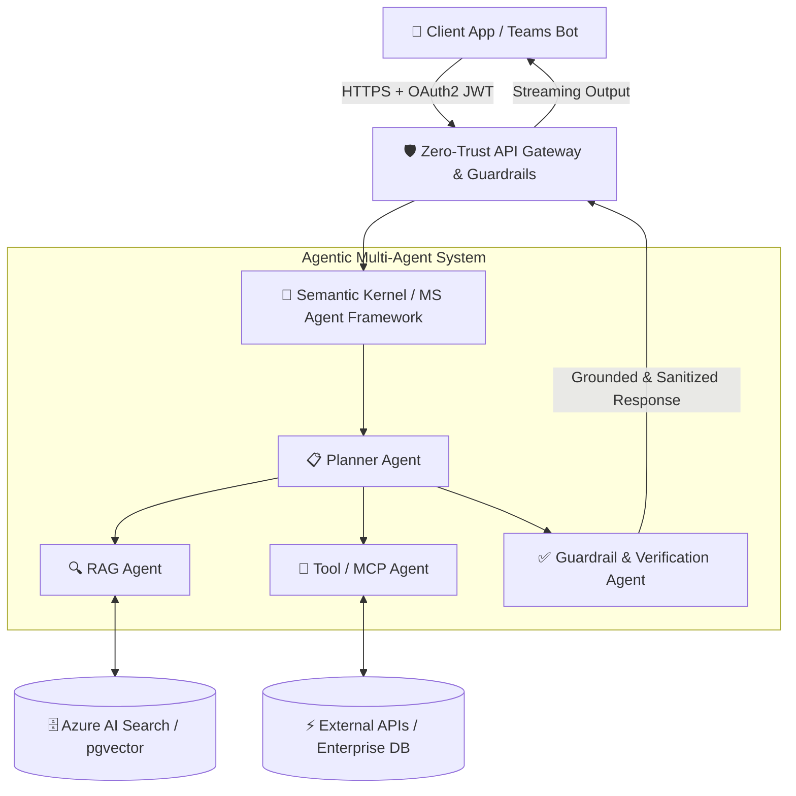
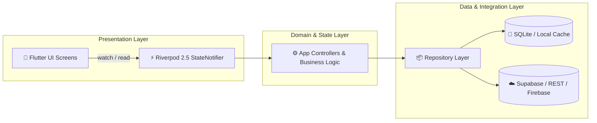
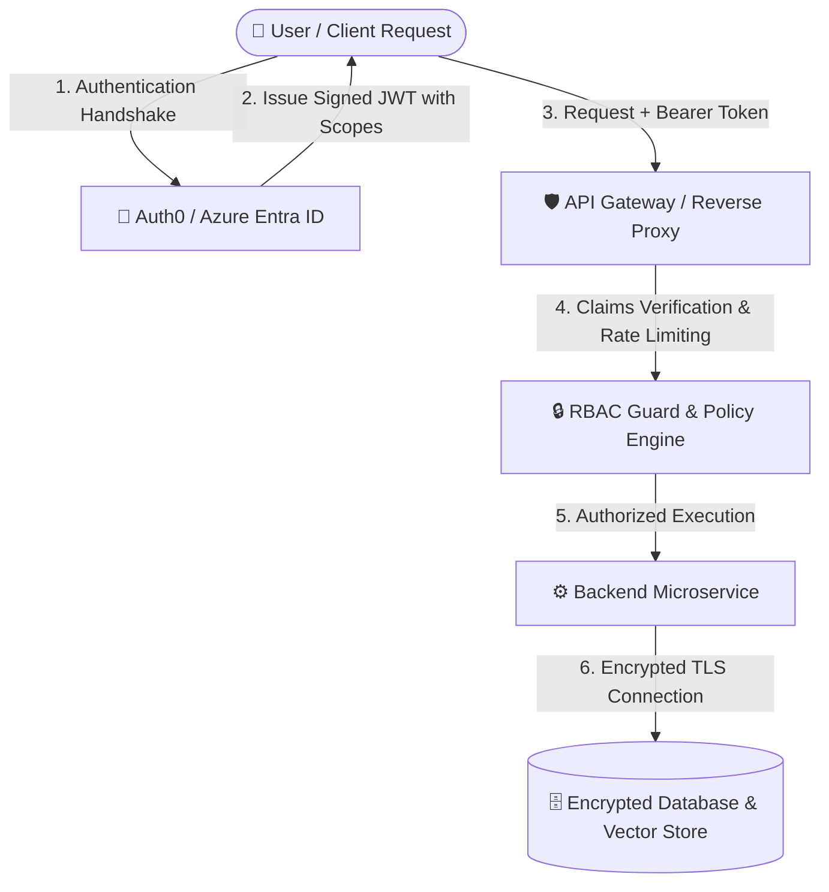

  <h1 align="center">Hi there, I'm Chandima Mahela Siriwardana 👋</h1>
  
  

  

    
    
    
    
  

  <!-- GitHub Profile Trophies -->
  

    
  

---

### 🚀 About Me

Hey there! 👋 I'm an **AI Engineer & Solutions Architect** with strong foundations in **Cross-Platform Mobile Engineering (Flutter)** and **Enterprise Software Architecture**. I help businesses turn ambitious ideas into secure, high-impact, enterprise-grade AI and mobile systems.

- 🤖 **Agentic AI & Intelligent Systems**: Architecting autonomous multi-agent workflows, tool-augmented copilots, and high-precision RAG systems using **Microsoft Agent Framework**, **Azure AI Foundry**, and **Semantic Kernel**.
- 📱 **Cross-Platform Mobile (Flutter & Dart)**: Crafting fluid, production-ready iOS & Android apps with modern state management (**Riverpod**, **Bloc**), geolocation/maps, push notifications, and offline-first syncing.
- 🛡️ **Secure by Design**: Designing high-availability architectures built on **Zero-Trust principles**, **Threat Modeling**, **OWASP LLM Security**, and enterprise RBAC/Auth0.
- ⚡ **Full-Stack & Distributed Backends**: Deep hands-on experience across **Python (FastAPI)**, **.NET 8 / C#**, and **React / Next.js** to deliver rock-solid production platforms.
- 🔌 **Agentic Tooling & MCP**: Building custom **Model Context Protocol (MCP)** servers to bridge AI agents with native mobile emulators and real-world tools.

---

### 🏛️ Core Architectural & Engineering Pillars

<table>
  <tr>
    <td width="33%" valign="top">
      <h4 align="center">🤖 Agentic AI & RAG</h4>
      <ul>
        <li><b>Microsoft Agent Framework</b> & AutoGen</li>
        <li><b>Azure AI Foundry</b> & Azure OpenAI</li>
        <li><b>Semantic Kernel</b> & LangChain</li>
        <li>Advanced RAG & Vector Indexing</li>
        <li>Model Context Protocol (MCP) Tooling</li>
      </ul>
    </td>
    <td width="33%" valign="top">
      <h4 align="center">📱 Mobile & Edge Engineering</h4>
      <ul>
        <li><b>Flutter & Dart</b> (iOS & Android)</li>
        <li><b>Riverpod & Bloc</b> State Architecture</li>
        <li>Supabase, Firebase Core & Cloud Messaging</li>
        <li>Google Maps API & Geolocation Tracking</li>
        <li>Mobile Screen MCP (Agentic Device Control)</li>
      </ul>
    </td>
    <td width="33%" valign="top">
      <h4 align="center">🛡️ Secure Enterprise Systems</h4>
      <ul>
        <li><b>Zero Trust Architecture</b> & Threat Modeling</li>
        <li><b>Python</b> (FastAPI, SQLAlchemy Async)</li>
        <li><b>.NET 8 / C#</b> (ASP.NET Core, EF Core)</li>
        <li><b>Next.js & React</b> (TypeScript, Tailwind)</li>
        <li>PostgreSQL (pgvector), MSSQL, Docker</li>
      </ul>
    </td>
  </tr>
</table>

---

### 🔍 Interactive System Blueprints & Architecture Deep-Dives

<b>🤖 Click to expand: Enterprise Multi-Agent & RAG Architecture Blueprint</b>

 

> **Key Design Highlights**:
> - **Input/Output Sanitization**: OWASP LLM prompt injection defenses and PII masking.
> - **Hybrid Retrieval**: Dense vector embeddings paired with sparse BM25 keyword search.
> - **Multi-Agent Coordination**: Autonomous tool-calling with deterministic fallback loops.

<b>📱 Click to expand: Flutter Production State & Clean Architecture Flow</b>

 

> **Key Design Highlights**:
> - **Predictable State Flow**: Unidirectional data flow with Riverpod providers and GoRouter routing.
> - **Offline-First Resilience**: Automatic local persistence with background synchronization.
> - **Agentic Device QA**: Automated testing via custom Mobile Screen MCP integration.

<b>🛡️ Click to expand: Zero-Trust Security & Identity Blueprint</b>

 

---

### 💻 Technologies & Tools

#### 🤖 AI, Machine Learning & LLMOps

  
  
  
  
  
  
  
  
  

#### 📱 Mobile Development & Cross-Platform

  
  
  
  
  
  
  
  

#### ☁️ Cloud, Security & DevOps

  
  
  
  
  
  
  

#### ⚙️ Backend, Web & Enterprise Languages

  
  
  
  
  
  
  
  
  

#### 🗄️ Databases & Vector Storage

  
  
  
  
  

---

### 📂 Featured Solutions & Projects

<table>
  <tr>
    <td width="50%" valign="top">
      <h4>🤖 Transporter Mini — AI Fleet & Route Optimization</h4>
      
AI-powered corporate transport management system with automated agent booking, intelligent route planning, and MS Teams integration.

      

        
        
        
        
      

      <ul>
        <li>Async SQLAlchemy 2.0 backend with Redis caching</li>
        <li>Conversational transport booking bot for MS Teams</li>
        <li>React 18 + TypeScript + Vite responsive dashboard</li>
      </ul>
    </td>
    <td width="50%" valign="top">
      <h4>📱 Yakadaweda — Commercial Steel & Materials Platform</h4>
      
Production cross-platform mobile marketplace connecting customers and suppliers across Sri Lanka with realtime tracking.

      

        
        
        
        
      

      <ul>
        <li>Reactive state architecture powered by Flutter Riverpod 2.5</li>
        <li>Integrated Google Maps geolocation & live supplier discovery</li>
        <li>Supabase Postgres BaaS + Firebase Push Notifications</li>
      </ul>
    </td>
  </tr>
  <tr>
    <td width="50%" valign="top">
      <h4>🔌 Mobile Screen MCP — Agentic Mobile Automation</h4>
      
Model Context Protocol server enabling LLM agents to autonomously inspect, tap, type, and navigate booted iOS & Android emulators.

      

        
        
        
        
      

      <ul>
        <li>Local screenshot capture & coordinate-based tap execution</li>
        <li>Automated agent-driven mobile QA and UX flows</li>
        <li>Cross-platform support for macOS Simulators and ADB devices</li>
      </ul>
    </td>
    <td width="50%" valign="top">
      <h4>🏢 <a href="https://github.com/mahela98/EMVS-Employee-Management-Visualization-System-Readme">EMVS — Enterprise Management & Visualization</a></h4>
      
Enterprise management platform built with modern architectural patterns, interactive analytics, and robust security.

      

        
        
        
        
      

      <ul>
        <li>OData REST APIs with Entity Framework Core & MSSQL</li>
        <li>Secure JWT & Auth0 enterprise authentication</li>
        <li>Material UI v5 & Chart.js data analytics visualization</li>
      </ul>
    </td>
  </tr>
</table>

---

### 🐍 Contribution Activity

  <picture>
    <source media="(prefers-color-scheme: dark)" srcset="https://raw.githubusercontent.com/mahela98/mahela98/output/github-contribution-grid-snake-dark.svg">
    <source media="(prefers-color-scheme: light)" srcset="https://raw.githubusercontent.com/mahela98/mahela98/output/github-contribution-grid-snake.svg">
    
  </picture>

---

### 📊 GitHub Analytics

  

    
    
  

  

    
  

---

### 🤝 Let's Connect & Collaborate

  
Always open to discussing <b>AI Solution Architecture</b>, <b>Mobile App Development (Flutter)</b>, or <b>Secure Enterprise Systems</b>.

  

    
    &nbsp;
    
  

