  

    
  
  

  

    
    
    
    
  

  

    <b>AI Engineer & Solutions Architect</b> building secure multi-agent systems, cross-platform Flutter mobile apps, and scalable cloud backends.
  

 

### 🛠️ Tech Stack

**AI & Agentic Systems**  

 

**Mobile & Frontend**  

 

**Backend, Cloud & Security**  

 

### 🚀 Featured Projects

<table>
  <tr>
    <td width="50%" valign="top">
      <h4>📱 Yakadaweda</h4>
      
Commercial mobile marketplace built with Flutter, Riverpod, Supabase, and Google Maps live tracking.

      

        
        
        
      

    </td>
    <td width="50%" valign="top">
      <h4>🏢 <a href="https://github.com/mahela98/EMVS-Employee-Management-Visualization-System-Readme">EMVS Platform</a></h4>
      
Enterprise management system featuring .NET Core OData APIs, Auth0 security, and React analytics.

      

        
        
        
      

    </td>
  </tr>
  <tr>
    <td width="50%" valign="top">
      <h4>🧪 <a href="https://github.com/mahela98/ChemHub-Chemical-Management-Distribution-System">ChemHub System</a></h4>
      
Chemical inventory & distribution system with realtime cloud sync, Firebase Auth, and Material UI.

      

        
        
        
      

    </td>
    <td width="50%" valign="top">
      <h4>🔒 <a href="https://github.com/mahela98/NestJs-Auth0-Gym-App-Backend">NestJS Enterprise API</a></h4>
      
Modular microservices backend with secure role-based access control, Auth0 JWT, and MongoDB.

      

        
        
        
      

    </td>
  </tr>
</table>

 

### 📊 Activity & Stats

  <picture>
    <source media="(prefers-color-scheme: dark)" srcset="https://raw.githubusercontent.com/mahela98/mahela98/output/github-contribution-grid-snake-dark.svg">
    <source media="(prefers-color-scheme: light)" srcset="https://raw.githubusercontent.com/mahela98/mahela98/output/github-contribution-grid-snake.svg">
    
  </picture>

  

    
    
  

  

    
  

